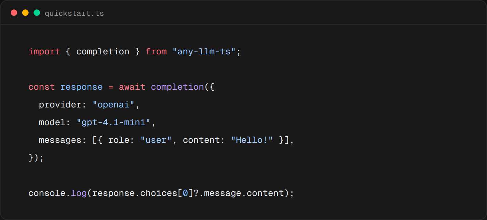

<div align="center">

# any-llm-ts

**Use multiple LLM providers through one typed TypeScript interface.**

An independent TypeScript port inspired by [mozilla-ai/any-llm](https://github.com/mozilla-ai/any-llm).



</div>

`any-llm-ts` is a thin, framework-independent layer over official provider SDKs. It gives applications one API for chat completions, streaming, tools, embeddings, model discovery, the OpenAI Responses API, images, moderation, and audio without requiring a hosted proxy.

The package uses the official OpenAI and Anthropic SDKs. OpenAI-compatible providers share a data-driven adapter, so switching providers is usually one string change.

## Installation

```bash
npm install any-llm-ts
```

Node.js 20 or newer is required.

## Quick start

```ts
import { completion } from "any-llm-ts";

const response = await completion({
  provider: "openai",
  model: "gpt-4.1-mini",
  messages: [{ role: "user", content: "Hello!" }],
});

console.log(response.choices[0]?.message.content);
```

Set the provider's conventional environment variable first, such as `OPENAI_API_KEY`, `ANTHROPIC_API_KEY`, or `MISTRAL_API_KEY`. You can also pass `apiKey` explicitly.

The combined `provider:model` form is useful for small scripts:

```ts
const response = await completion({
  model: "anthropic:claude-sonnet-4-5",
  messages: [{ role: "user", content: "Explain subgrid in one paragraph." }],
});
```

## Reusable clients

Create a client once when your application makes multiple requests. The underlying SDK client and its connection pool are reused.

```ts
import { AnyLLM } from "any-llm-ts";

const llm = AnyLLM.create("mistral");

const first = await llm.completion({
  model: "mistral-small-latest",
  messages: [{ role: "user", content: "Give me a project name." }],
});

const second = await llm.completion({
  model: "mistral-small-latest",
  messages: [{ role: "user", content: "Give me another one." }],
});
```

## Streaming

`stream: true` changes the inferred return type to `AsyncIterable<ChatCompletionChunk>`.

```ts
const stream = await completion({
  provider: "groq",
  model: "llama-3.3-70b-versatile",
  messages: [{ role: "user", content: "Write a haiku about TypeScript." }],
  stream: true,
});

for await (const chunk of stream) {
  process.stdout.write(chunk.choices[0]?.delta.content ?? "");
}
```

Errors raised while consuming a stream are normalized just like errors raised while creating it.

## Tool calling

Tools use the widely supported OpenAI function-tool shape. The Anthropic adapter translates tools, tool choices, assistant tool calls, and tool results in both directions.

```ts
const response = await completion({
  provider: "anthropic",
  model: "claude-sonnet-4-5",
  messages: [{ role: "user", content: "What is the weather in Kolkata?" }],
  tools: [
    {
      type: "function",
      function: {
        name: "get_weather",
        description: "Get current weather for a city",
        parameters: {
          type: "object",
          properties: { city: { type: "string" } },
          required: ["city"],
        },
      },
    },
  ],
});

console.log(response.choices[0]?.message.toolCalls);
```

## OpenAI-compatible endpoints

Use any unlisted OpenAI-compatible gateway or local server without registering it globally:

```ts
const llm = AnyLLM.createOpenAICompatible({
  name: "company-gateway",
  apiBase: "https://llm.example.com/v1",
  apiKey: process.env.COMPANY_LLM_API_KEY,
});

const response = await llm.completion({
  model: "internal-model",
  messages: [{ role: "user", content: "Hello" }],
});
```

Set `requiresApiKey: false` for a keyless local endpoint.

## Providers

The initial port includes 37 provider configurations.

| Adapter | Providers |
| --- | --- |
| Native Anthropic translation | `anthropic` |
| Official OpenAI SDK | `openai`, `azureopenai` |
| OpenAI-compatible registry | `atlascloud`, `cascadia`, `cerebras`, `dashscope`, `databricks`, `deepinfra`, `deepseek`, `edenai`, `fireworks`, `gmi`, `groq`, `inception`, `kenari`, `llama`, `llamacpp`, `llamafile`, `lmstudio`, `minimax`, `mistral`, `moonshot`, `nebius`, `neosantara`, `ollama`, `openrouter`, `perplexity`, `portkey`, `qiniu`, `requesty`, `sambanova`, `telnyx`, `together`, `vllm`, `xai`, `zai` |

Registry metadata is intentionally conservative. Inspect capabilities at runtime instead of assuming every provider implements every OpenAI endpoint:

```ts
const metadata = AnyLLM.getProviderMetadata("deepseek");
console.log(metadata.capabilities);

const providers = AnyLLM.getAllProviderMetadata();
```

Provider configuration reflects API compatibility, not a claim that every provider is continuously integration-tested. Native adapters for non-OpenAI-compatible services such as Gemini, Bedrock, Cohere, and Voyage are natural follow-up work.

## Other operations

The reusable client exposes:

```ts
await llm.responses({ model, input });
await llm.embedding({ model, input });
await llm.listModels();
await llm.imageGeneration({ model, prompt });
await llm.transcription({ model, file });
await llm.speech({ model, input, voice });
await llm.moderation({ input });
```

Stateless camel-cased helpers with the same names are exported from the package. An unsupported operation rejects with `UnsupportedOperationError`. Provider-specific request fields can be added through `providerOptions` and SDK constructor fields through `clientOptions`.

The Anthropic client additionally exposes `messages(request)` for direct access to the native Messages API.

## Errors

Provider SDK failures are converted into a common hierarchy:

- `AuthenticationError`
- `InvalidRequestError`
- `RateLimitError`, including `retryAfter` when supplied
- `ModelNotFoundError`
- `ContextLengthExceededError`
- `ContentFilterError`
- `ProviderError`, `UpstreamProviderError`, and `GatewayTimeoutError`

Each `AnyLLMError` retains the original error as `cause` and exposes provider-independent `statusCode`, `code`, `param`, `errorType`, and `provider` fields where available.

## Custom adapters

Extend `BaseProvider`, then register a factory. This keeps provider-specific translation isolated while preserving the common facade.

```ts
import { registerProvider } from "any-llm-ts";

// CompanyProvider extends BaseProvider and implements metadata and completion().
registerProvider("company", (options) => new CompanyProvider(options), {
  metadata: companyMetadata,
});
```

See [PORTING.md](./docs/PORTING.md) for the architectural analysis, what was deliberately preserved, and where TypeScript-specific choices differ from the Python project.

The Fumadocs site is maintained in [`apps/docs`](./apps/docs). Run `npm run docs:dev` on Node.js 22
or newer to preview it locally.

## Development

```bash
npm install
npm run check
```

`npm run check` runs strict type-checking, ESLint, unit tests with coverage gates, and the dual ESM/CommonJS build.

## Attribution and license

This is an independent port, not an official Mozilla.ai project. It takes architectural inspiration from [mozilla-ai/any-llm](https://github.com/mozilla-ai/any-llm), which is licensed under Apache-2.0. See [NOTICE](./NOTICE) and [LICENSE](./LICENSE).
